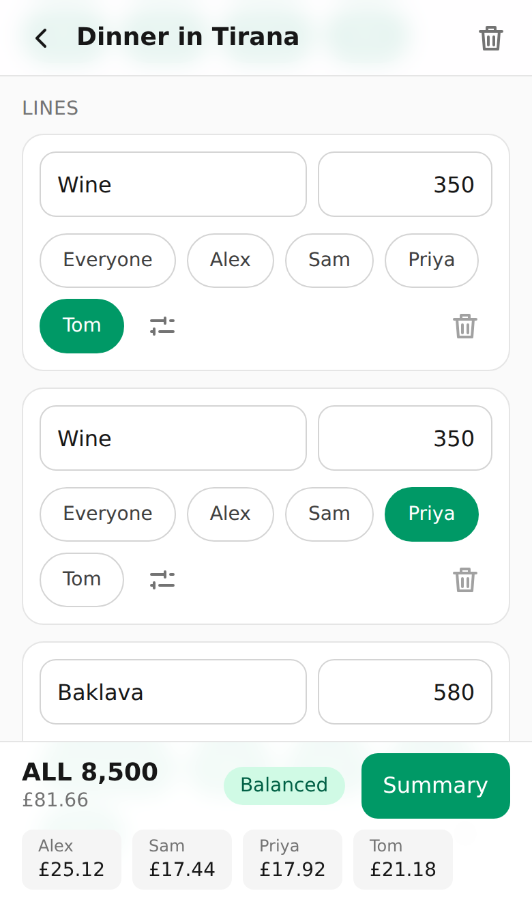
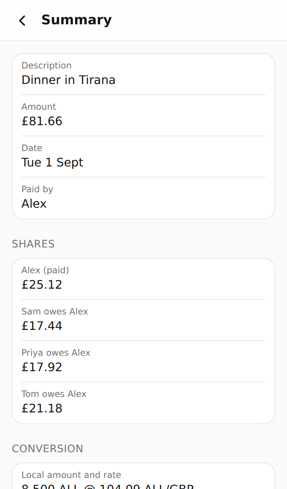
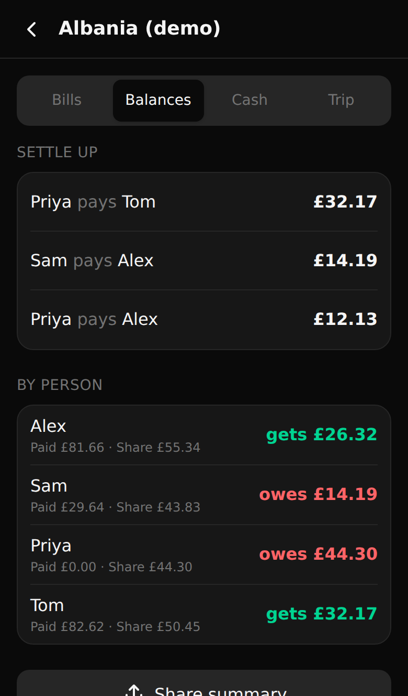

# Bill Splitter

[](https://github.com/moverperfect/bill-splitter/actions/workflows/ci.yml)

A phone-first web app for splitting group bills item by item, in any currency, and working out who owes whom. Everything is stored on the device, and it works offline.

**Live:** [splitter.moverperfect.com](https://splitter.moverperfect.com). Tap **Try a demo trip** to see it with sample data.

<p>
  
  
  
</p>

## Why

On a trip abroad, splitting a restaurant bill fairly means several steps:

1. Working out who had what.
2. Sharing the tip and any shared plates.
3. Converting the result to the currency the group settles up in, at the rate you actually paid.

This app does all three: one tap per person per dish, and the totals add up to the penny.

## Features

- **Line-by-line splitting.** Tap the names of whoever had each dish, use **Everyone** for shared plates, or give someone a double share.
- **Tips, fees and discounts**, as an amount or a percentage, split equally or in proportion to what each person ordered.
- **Any currency.**
  - Cash bills use the rate from your recorded withdrawals, including ATM fees.
  - Card bills use the amount your bank charged.
  - Currencies with no decimal places (yen, won) and with three (dinar) are handled correctly.
- **Sums in any amount field.** You can type `2×350` or `200/173.40`, and a calculator row of + − × ÷ appears above the phone keyboard.
- **Trip balances**: what each person paid and owes, and the fewest payments that settle everyone up. You can send the summary through the phone's share sheet.
- **Splitwise mode (optional).** It lays out each bill in the order of Splitwise's "split by exact amounts" form, with a copy button on every value. It also tracks which bills you've entered, and flags any whose amounts changed after you entered them.
- **Offline and private.**
  - The app installs to your phone's home screen and needs no account or server.
  - Data stays in the browser, with JSON export/import for backups.

## How the maths works

The split logic is a pure TypeScript module ([`src/domain/split.ts`](src/domain/split.ts)) with no UI dependencies.

1. Each item's cost is divided by share units: a double share counts 2, and leaving someone out counts 0.
2. Adjustments are applied next. A percentage tip is based on the item subtotal. "By order" adjustments are split in proportion to each person's items.
3. The bill is converted to the home currency **once**, for the whole bill. Cash bills use the withdrawal rate; card bills use the amount charged.
4. That home total is split into minor units (pence, cents, yen) in proportion to each person's local share, using the **largest-remainder method**. The shares therefore always add up exactly to the amount on the bank statement, and nobody is out by a penny.

Trip balances are each person's (paid − share), summed over all the trip's complete bills. To suggest payments, the app repeatedly matches the person who owes most with the person who is owed most. That always settles everyone in at most n − 1 payments.

## Tech

- React 19, TypeScript, Vite, and Tailwind CSS 4.
- Zustand + Immer for state, saved to `localStorage` with versioned migrations ([data format](docs/data-format.md)).
- `vite-plugin-pwa` / Workbox for offline support and installing to the home screen.
- Vitest for the split maths, balances, migrations and the expression parser. Biome for linting and formatting.
- Deployed as a static-assets Cloudflare Worker. Routing is hash-based, so there's no server code at all.

## Development

```sh
pnpm install
pnpm dev        # dev server
pnpm test       # unit tests
pnpm lint       # Biome
pnpm build      # typecheck + production build to dist/
```

## Deploying your own copy

`wrangler.jsonc` deploys `dist/` as a Worker on `splitter.moverperfect.com`. Change the `routes` entry to your own domain, or delete it to use a `workers.dev` address. Then:

```sh
pnpm exec wrangler login
pnpm run deploy   # build + wrangler deploy (plain `pnpm deploy` is a pnpm built-in)
```

To deploy automatically on every push instead, connect the repo in the Cloudflare dashboard under **Workers & Pages → bill-splitter → Settings → Builds**. Use build command `pnpm run build` and deploy command `npx wrangler deploy`.

Any static host works too: serve the `dist/` folder.

## Roadmap

- Share a trip with the group by link or file, built on the [versioned data format](docs/data-format.md).
- Record payments as they happen, so balances count down to zero.

## License

[MIT](LICENSE)
